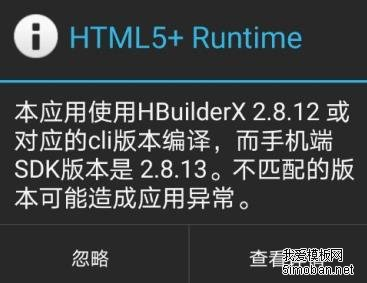

## 一、Android11适配
android11适配 manage权限，原先的权限只能请求多媒体文件，全部文件需要另外申请


https://blog.csdn.net/xhmj12/article/details/105828196

（安卓11来了，快！起来填坑了）


平台版本    API级别（SDK版本）    版本代号    发布时间
Android 11    30          R           2020.9
Android 10.0    29       Q         2019.8

```
@RequiresApi(api = Build.VERSION_CODES.R)
    private void requestStorage(){
        if(Environment.isExternalStorageManager()){
            //if (Permission.checkPermissions(LoginActivity.this, Permission.DIR_PERMISSION_MANAGE)) {
            //todo when permission is granted
        } else {
            //request for the permission
            Intent intent = new Intent(Settings.ACTION_MANAGE_APP_ALL_FILES_ACCESS_PERMISSION);
            Uri uri = Uri.fromParts("package", getPackageName(), null);
            intent.setData(uri);
            startActivity(intent);
        }
    }
```
@require部分为注释，只影响ide报错，不影响运行

## 二、HBuilderX不匹配版本
UNI-APP 打包提示：本应用使用HBuilderX 3.2.2 或对应的cli版本编译，而手机端SDK版本是3.1.
昨天升级了下HBuilderX，今天编译打包APP时，出现了下面的提示：

==本应用使用HBuilderX 3.2.2 或对应的cli版本编译，而手机端SDK版本是3.1.22，不匹配的版本可能造成应用异常==

 


具体原因已经说的很清楚了，其实大部分不会出现问题，如果想忽略提示，可以按照下面的方法进行：
可以在manifest.json文件的源码视图中配置忽略这个提醒，方式如下：

HBuilderX1.9.0及以上版本新增以下配置避免弹出提示框
```
"app-plus": {
    "compatible": {
        "ignoreVersion": true // true表示忽略版本检查提示框，HBuilderX1.9.0及以上版本支持
    },
}, 
```
以下方法可针对指定版本避免弹出提示框
```
"app-plus": {  
    "compatible": {  
        "runtimeVersion": "1.7.0", // 根据实际情况填写
        "compilerVersion": "1.7.1" // 根据实际情况填写
    },  
},
```
